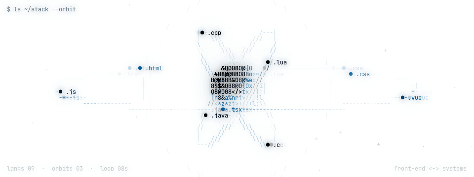

<!-- Generated artwork. scripts/render_cards.py draws every card twice, cards/<name>-light.svg and
     -dark.svg, from data/content.json (the copy) and data/profile.json (contributions). The README
     shows white artwork while the sun is up in Bucharest and black after sunset: scripts/daynight.py
     rewrites the -light/-dark suffixes (and the badge colours), run by .github/workflows/profile.yml.
     Edit the JSON, not the SVGs. Keep this block free of blank lines. -->

 
 
 
 
 
 

  
  
  
  
  
  
  
   
  
  
  
  
  
  
  
  
  
   
  
  
  
  
  
  
  
   
  
  
  
  

